# AquaCRM full browser walkthrough audit — 2026-08-23

> **Current correction, 2026-08-24:** this report passed the browser paths it
> exercised, but its “public showcase is read-only” conclusion was too broad.
> The proxy exempts `GET`; Google Calendar/Meta OAuth callbacks and other hidden
> GET-side mutations can write. The fixture is also shared/reset per visit. See
> current issues #21/#23; the dated observations below remain browser evidence,
> not a security acceptance result.

## Remediation re-audit — 2026-08-23 02:41 BST

**PASS for the nine findings in this browser audit; the broader application is
still not release-ready.** The original observations below are retained as
pre-remediation evidence, not as a description of the current runtime.

| Finding | Current status | Reproducible evidence |
| --- | --- | --- |
| AUD-01 | Fixed | The public session is now a visitor with read-only effective permissions. Mutation controls are absent or disabled on the audited agency and client surfaces. With the real showcase cookie, `POST`, `PATCH`, and `DELETE /api/portal/tasks` each returned `403`. The root `middleware.ts` now delegates to `src/proxy.ts`, so that boundary is active in the running app rather than existing only in tests. |
| AUD-02 | Fixed | Public requests for `/portal/dev-team`, `/portal/agency/settings`, Actions, and Email Sender redirect to `/portal/agency`; internal Dev/source APIs are denied. The public portal editor is visual-only and does not expose source, assistant, save, add, or publish controls. |
| AUD-03 | Fixed | `/showcase` now purges and recreates one fixed showcase tenant with fictional `.example` identities. Agency and client chrome agree on fictional showcase branding, and the re-audited client hub contained neither the previously observed personal data nor the offensive fixtures. |
| AUD-04 | Fixed | Battle Table tolerates scope-less intelligence items and reached its final UI in the browser. The Battle Table and Command Centre regression suites pass. |
| AUD-05 | Fixed in the current local development environment | The 20–40 second outliers were not reproducible after remediation. Warm real-cookie requests were: agency `0.342s`, clients `0.081s`, Battle `0.078s`, SOP library `0.069s`, and preferences → permissions `0.113s`; a repeated showcase reset was `1.752s`. This is not a production cold-start guarantee. |
| AUD-06 | Fixed | The in-app Auditor aggregates source findings, document blockers, and readiness prerequisites. It now says “Source checks clear”, never “All clear”, and explicitly states that source checks do not replace browser, authorization, tenant-isolation, crash, public-flow, or performance audits. |
| AUD-07 | Fixed | Preferences resolves to `/portal/account/permissions`; SOPs resolves to `/portal/agency/sop-library`; client `?tab=systems` remains on the Systems view. |
| AUD-08 | Fixed | The editor toolbar is bounded and horizontally scrollable instead of clipping controls; browser checks passed at 360, 390, and 430 CSS pixels. |
| AUD-09 | Fixed | The Health Check loads the complete question pack before rendering. Its source regression proves five topics with Beginner, Dabbler, and Pro choices, and `/health-check` loads the real diagnostic app. |

The focused remediation suite passed **76/76 tests** with zero failures, and
typecheck passed at the remediation checkpoint. A completed full-suite snapshot
then reported **3,591 pass / 27 fail / 1 skipped out of 3,619 tests** while other
workers were changing the checkout. Those failures include stale source-shape
assertions. One initially appeared to flag six non-plugin API routes, but the
routes already use the shared session-derived `routeTenantScope` guard; the audit
matcher was updated to recognise that safe form and now passes. The remaining
broader blockers are recorded in the authoritative [checklist](checklist.md), so
this finding-level pass must not be read as a release pass.

## Original verdict (pre-remediation)

**FAIL — the localhost build is not release-ready.**

The breadth is real: every one of the 110 App Router page templates was exercised in a browser, and most tested desktop and representative mobile screens render without broken images, root-level horizontal overflow, or a visible error boundary. The release verdict is still a clear failure because the unauthenticated public showcase becomes an account owner, exposes internal source and Dev Team surfaces, and does not reliably stay inside the promised sanitised fixture dataset. The Battle Table does not load successfully, and the public Health Check cannot be answered.

This report records the behaviour of the running application, not an inference from stale documentation.

## Target, timing, and method

- Runtime: `http://localhost:3032`
- Runtime process at audit time: `next-server` 16.3.0
- Confirmed process working directory: `/Users/eds/Desktop/Projects/Web Development/Personal EcoSystem/aquaCRM/portal`
- Audit date: 2026-08-23; continuation and final blocker recheck completed at approximately 01:38 BST
- Persona: unauthenticated visitor entering through `/showcase`, then identified by the UI as `Demo visitor`
- Source inventory: 110 App Router `page.*` files
- Template coverage: **110/110 page templates exercised** using a valid fixture where one existed and a safe invalid/empty state where no valid token or record existed
- Navigation coverage: at least 140 distinct route, redirect, query-view, tab, and dynamic-record states
- Interaction coverage: public and app mobile menus, Health Check journey, workspace search, Command Centre station switching, all Settings tabs, all principal client workspace tabs, all Marketing views, all Fulfilment views, all client-preview sections, and all three portal-editor modes
- Viewports: desktop at 1680 × 920 and 1280 × 720; verified responsive pass at 390 × 844
- Safety: read-only walkthrough. No Save, Add, Delete, Generate, Run, Clock in, Send, upload, provider connection, publication, external submission, or showcase-exit action was executed.

Other workers changed the application while this review was running. Where an initial and continuation observation differ, this report calls out the split instead of pretending the runtime was static. The latest observation is the best description of the current localhost state.

The structured measurements captured during the first automated route pass are in [route-results.jsonl](./visual-audit-2026-08-23/route-results.jsonl). Later interactive and dynamic-route evidence is recorded below.

## Release blockers

### AUD-01 — P0 — The public demo is an account owner, not a read-only visitor

Entry through `/showcase` requires no supplied credential and the global banner says `Interactive demo · Fictional data · Read-only`. However, `/portal/account/permissions` identifies the same `Demo visitor` as:

- Role: **Business owner**
- Badge: **Account owner**
- Allowed: Clients Create, Edit and Delete
- Allowed: Finance Edit
- Allowed: Employees Edit and Roles Edit
- Allowed: work-board and playbook management

Agency Settings also exposes enabled editable fields and a `Save settings` button. The audit did not submit a mutation, so backend write enforcement is not proven either way; the authorization and UI contract are already unsafe.

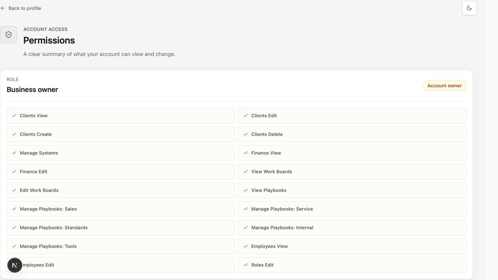

**Required outcome:** the public demo must use a separately enforced, non-owner role; every mutation must be rejected server-side as well as hidden or disabled in the UI.

### AUD-02 — P0 — The public demo reaches the internal development control plane

The same public session reached all of the following:

- `/portal/agency/dev-docs` — marked `DEV ONLY`, exposing an index of 2,186 internal files
- `/portal/agency/development/code` — repository browser exposing 3,514 files and root names including environment, agent, and package files
- `/portal/dev-team` and every Dev Team page template
- `/portal/dev-team/docs` — copy says edits save straight back
- `/portal/dev-team/plans/new` — an exposed plan-authoring screen
- Dev Team findings, roadmap, editor studio, library, API/MCP, chat, logs, tasks, updates, notes, working view, and inspector

The portal editor's Dev mode also exposes the workspace tree to the public owner session. This is an access-control failure, not merely a navigation issue. No document, code, or plan edit control was used.

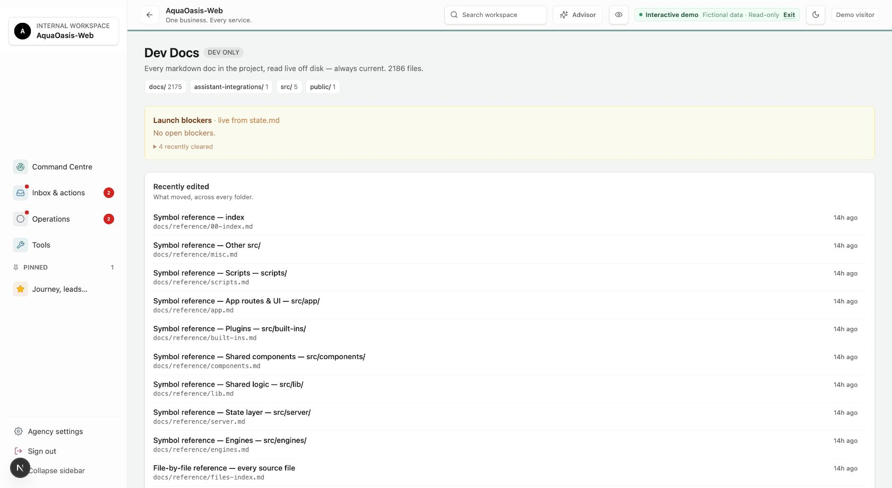

**Required outcome:** public-demo authorization must fail closed before internal page data is loaded. Internal docs, source browsing, Dev Team tools, editor Dev mode, and editing APIs must never be available to this session.

### AUD-03 — P0 — The promised fictional showcase dataset is not isolated reliably

The public banner says the data is fictional and read-only. Settings > Showcase says Showcase Mode uses a fixed isolated dataset and copies no real clients, finances, messages, or contacts.

Observed contradictions:

- `/portal/agency/contacts` displayed real-looking personal contact patterns, including a full name, email, and UK phone number. Exact values are deliberately redacted from this report.
- The same list contained multiple offensive racial-slur test records. The terms are deliberately not reproduced here.
- While the header said `Interactive demo`, Settings > Showcase still offered `Enter Showcase Mode`, indicating the public demo and the app's isolated Showcase Mode are not the same state.
- Agency pages use `AquaOasis-Web` as the internal workspace while client pages use `Milesymedia Showcase`, making the active tenant/data boundary unclear.

No screenshot of the contact list was retained, to avoid duplicating sensitive or offensive content.

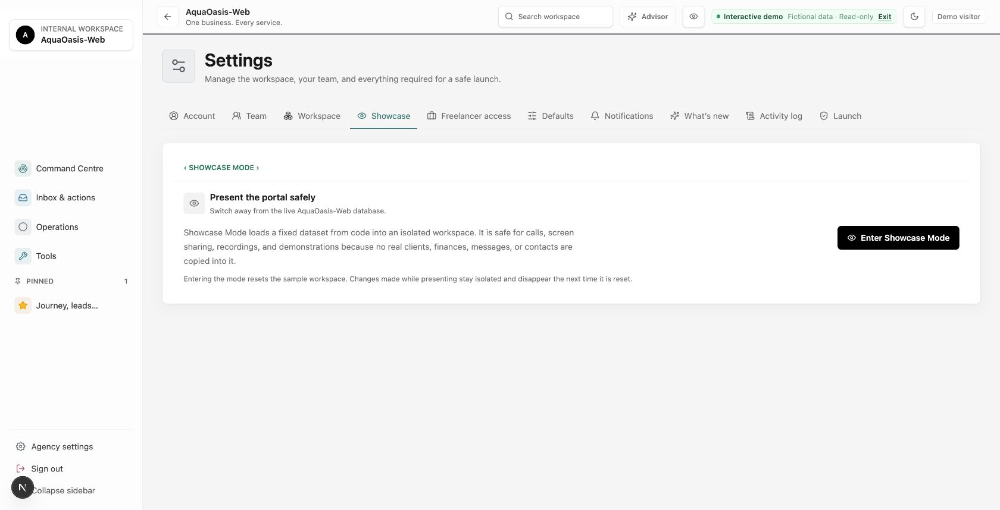

**Required outcome:** the public route must always enter one fixed tenant, one fixed role, and one sanitised fixture dataset. Purge offensive fixtures and prevent any live or file-backend tenant records from joining the session.

### AUD-04 — P1 — Battle Table does not load successfully from the real control

The initial pass reproduced a hard failure both through `/portal/agency/company` and by clicking the `Battle Table` station button in Command Centre.

Visible error:

```text
Something went wrong loading agency workspace.
Cannot read properties of undefined (reading 'kind')
```

The captured stack identified `applyIntelligenceScope` in `CommandIntelligenceWorkspace`, reached from `BattleTableWorkspace`.

Because workers were editing the runtime, the final recheck changed shape: a fresh tab remained on `Loading Command Centre…` for more than 40 seconds instead of reaching either the Battle Table or the earlier error boundary. The exact failure is moving, but the user outcome is unchanged: the Battle Table is not usable in the current audit window.

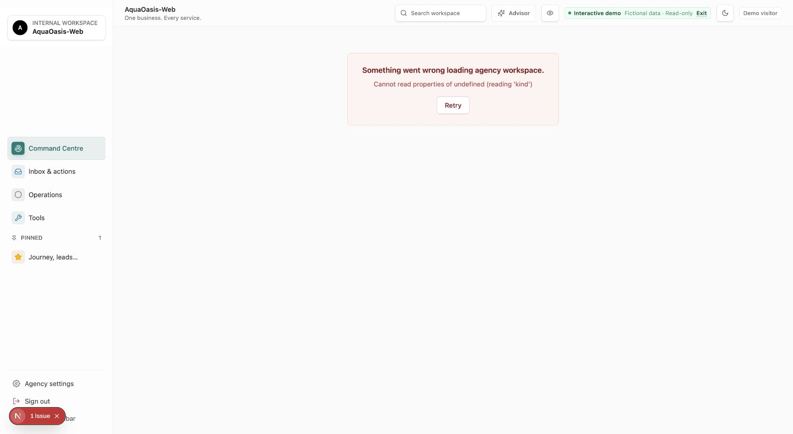

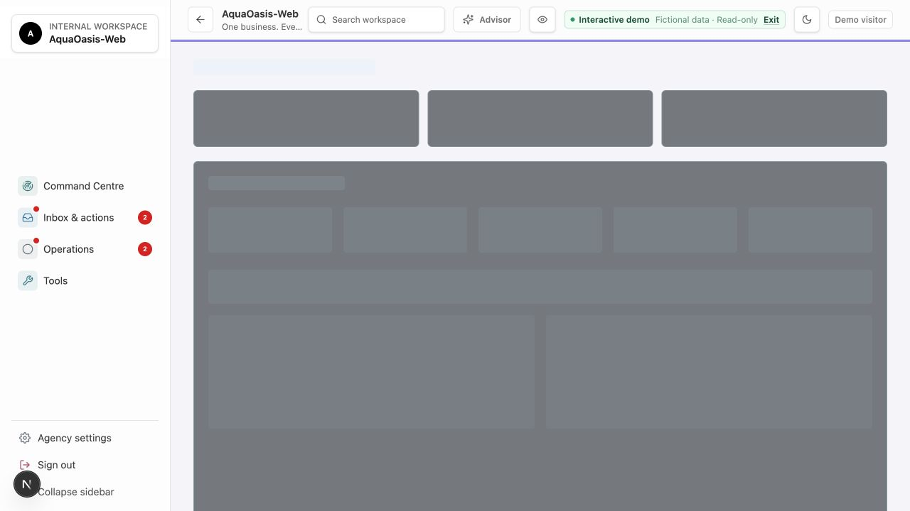

**Required outcome:** tolerate missing or malformed intelligence items, prevent an indefinite loading state, then add a browser regression that switches into Battle Table from Command Centre and waits for the final station UI.

### AUD-05 — P1 — Cold navigation remains outside a usable performance envelope

The editor is no longer accurately described as permanently unusable: once warm, its base route became controllable in roughly 1.4–8 seconds and all three modes responded. The cold path is still severe.

Observed cold or slow paths included:

- `/showcase` took about 33.6 seconds before the agency UI was fully available.
- `/portal/agency/pipelines/leads` exceeded 30 seconds before eventually rendering a healthy pipeline.
- `/portal/agency/portals/demo/stunning-standard` needed roughly 37 seconds to reach a usable editor on the first pass.
- The first direct editor attempts exceeded 30 seconds and destabilised browser control; warmed editor navigation later took about 1.4–8 seconds.
- A final cold recheck of `/portal/account/permissions` exceeded 30 seconds before eventually rendering the same owner permissions.
- An invalid development-project route took roughly 35–40 seconds to reach its safe not-found state.
- An invalid connection route took more than 27 seconds before showing a safe refusal.
- `/portal/agency/portals` took 24.1 seconds; the technical project alias took 23.0 seconds; the phase detail took 20.6 seconds.
- Technical workflow and website aliases took approximately 16.5–19.9 seconds.
- `/portal/dev-team/docs` took about 22.8 seconds; `/portal/dev-team` about 19.2 seconds; `/portal/agency/dev-docs` 15–16 seconds; Governance and Dev Team logs about 14.2 seconds.
- Each warmed Settings tab still took approximately 3.5 seconds to settle.

The pipeline did eventually render rather than remaining stuck.

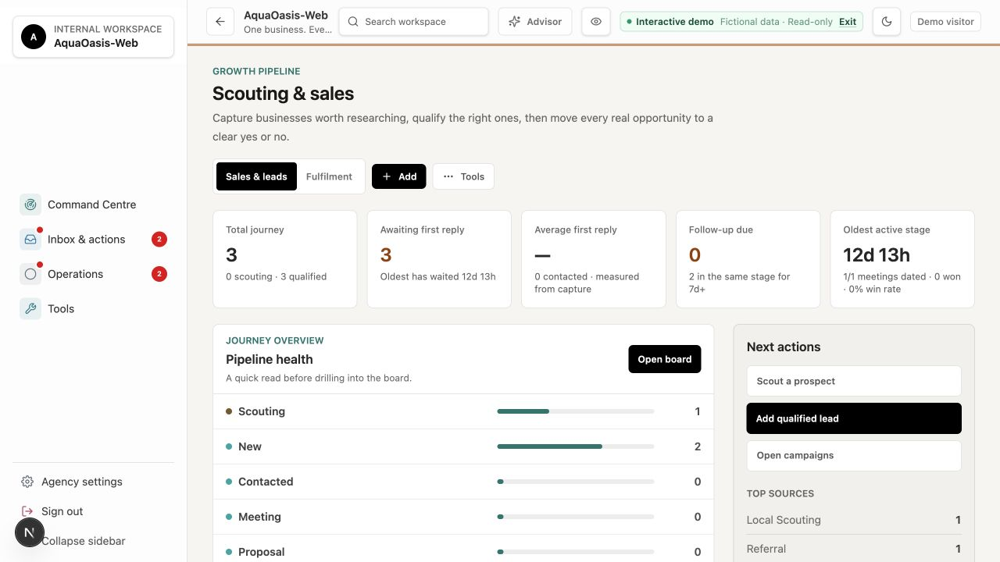

**Required outcome:** define a user-visible loading budget, profile the shared workspace hydration path, cache or defer heavyweight repository/project work, and make route shells interactive independently of slow secondary data.

### AUD-06 — P1 — The built-in launch status is falsely green

The public owner session can open `/portal/dev-team/findings?view=auditor`. That screen says `No open blockers`, sourced from `state.md` and the launch-readiness checks.

That statement is contradicted by AUD-01 through AUD-05 and AUD-09, as well as defects already listed in `checklist.md`. A release decision based on the in-app Auditor would be unsafe.

**Required outcome:** the in-app status must include browser authorization, isolation, hard-crash, critical public-flow, and performance gates, or clearly say those gates have not run.

### AUD-09 — P1 — The public Health Check cannot be answered

The landing page and start button work. After selecting `Service business`, the next transition briefly displays `Topic 1 of 0` with an empty topic description. Continuing reaches `Topic 1 of 5 · Visibility & Search`, but the intended Beginner, Dabbler, and Pro answer choices are absent. Only `Skip this topic` remains.

Skipping goes straight to a result that says there is not enough information. That fallback renders, but the main diagnostic and lead journey cannot be completed as designed.

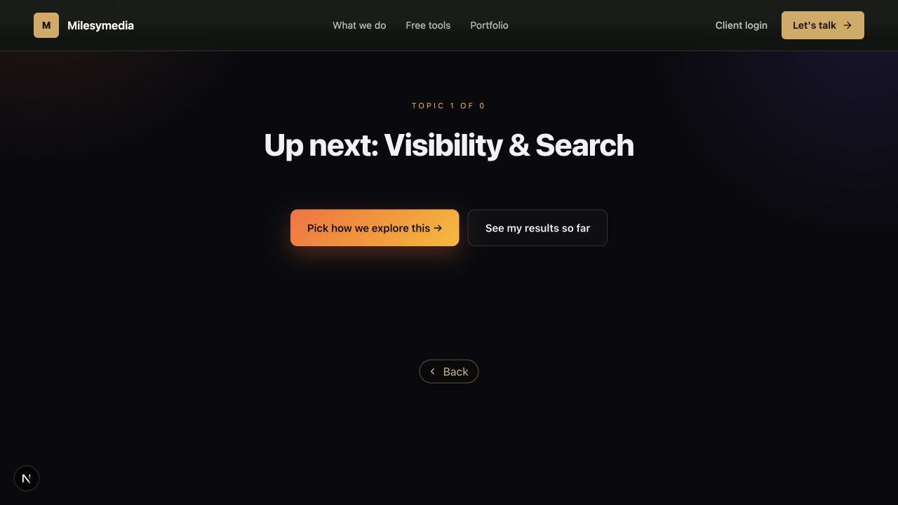

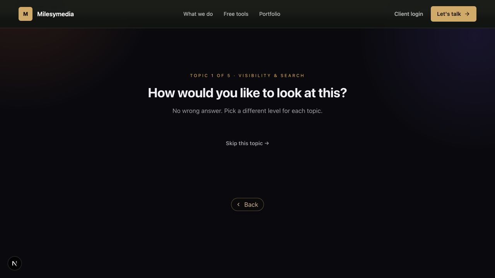

**Required outcome:** restore the topic definition and answer-choice data, reject a zero-topic state before rendering it, and add a browser test that completes all five topics without relying on Skip.

## Important lower-severity findings

### AUD-07 — P2 — Some compatibility and deep links land on the wrong screen

- `/portal/agency/sops` redirects to Command Centre, not `/portal/agency/sop-library`.
- `/portal/account/preferences` redirects to the generic account profile.
- Live alert links to `/portal/clients/:id?tab=systems` redirect to the client's Fulfilment tab. The Command Centre presents these links as the source for telemetry and availability findings, so the user lands somewhere unrelated to the promised evidence.
- `/resources` redirects to `/tools`, which appears intentional but should remain covered as a compatibility contract.
- `/portal/agency/products` correctly redirects to Fulfilment services.
- `/portal/agency/actions` correctly redirects to Inbox actions.
- `/portal/agency/automations` correctly redirects to Marketing automations.

The first three cases feel like lost navigation and can break bookmarks or operational investigation.

### AUD-08 — P2 — Mobile is broadly responsive, but the portal editor clips controls

A verified 390 × 844 pass succeeded across the public homepage, Health Check, Command Centre, Marketing Automations, Fulfilment Technical, client overview, client preview, and portal editor. These screens had no root-level horizontal overflow or broken images. The public mobile menu and app navigation drawer opened and closed correctly.

The portal editor is the exception: its header contains about 569 pixels of controls inside a 390-pixel container with horizontal overflow hidden. The `Two browsers side by side` control extends beyond the right edge, and custom-size inputs are partly off-screen. The preview canvas itself is horizontally scrollable by design, but the clipped toolbar controls are not all reachable in the visible header.

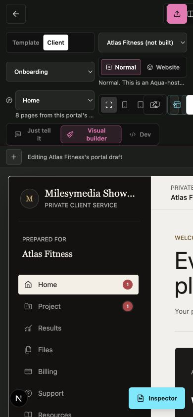

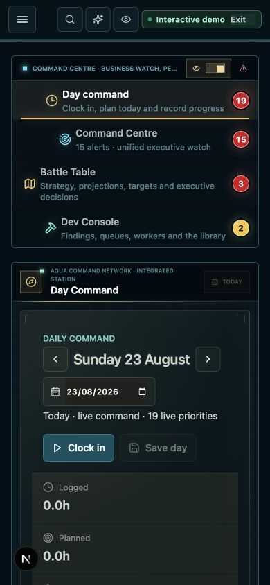

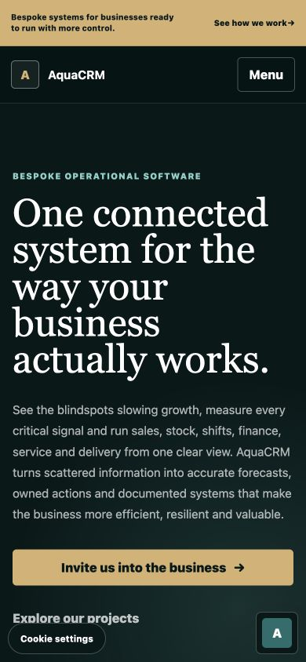

**Required outcome:** wrap, collapse, or horizontally scroll the editor toolbar without clipping interactive controls, then test editor mode and device controls at 360, 390, and 430 pixels.

## What worked

- All 110 App Router page templates reached a rendered, redirect, refusal, not-found, or role-gated state in the browser.
- Public homepage, Business OS, Client Centre, portfolio, case studies, tools, careers, login, reset, recovery, invalid magic-link, invalid proposal, invalid career-status, and connection-refusal states rendered safely.
- Command Centre, Inbox, Operations, Tools, Calendar, Settings, Activity Inbox, Assistant, Marketing, Fulfilment, People, Performance, Phases, SOP Library, Notepad, and the development workspaces rendered their main desktop views.
- Marketing Pulse, Demand, Funnels, Customers, Channels, and Automations all rendered without a visible error, broken image, or root overflow.
- Fulfilment Overview, Stage Board, Services, Technical, Aqua Tags, Client Workspaces, and Portals all rendered without a visible error, broken image, or root overflow.
- Client Overview, Relationship, Communications, Fulfilment, Commercial, Client Record, Portal, Files, and Settings rendered. The `systems` deep link is the exception documented in AUD-07.
- All eight private client-preview sections rendered: Home, Project, Results, Files, Billing, Support, Resources, and Your details.
- Portal-editor `Just tell it`, `Visual builder`, and `Dev` mode buttons all responded after warm-up. The audit returned the editor to Visual Builder and did not save or publish.
- Workspace search opened, accepted `clients`, exposed filters, and returned ranked results.
- Command Centre switched to its executive overview successfully; switching to Battle Table then reproduced AUD-04.
- All ten Settings tabs selected correctly: Account, Team, Workspace, Showcase, Freelancer access, Defaults, Notifications, What's new, Activity log, and Launch.
- Valid person, product, phase, pipeline, and development-project detail templates rendered. Organisation detail, proposal, career-status, and website-preview templates produced safe empty/not-found states because no suitable valid fixture existed.
- Customer, team, and freelancer role routes failed closed back to the agency workspace for this owner session instead of cross-opening another role's shell.
- Representative verified mobile screens had no root overflow or broken images, and both mobile menu systems worked.
- Measured desktop routes showed no duplicate IDs, basic unlabeled-button failures, or root-level horizontal overflow in the automated heuristics.
- The recurring Chrome-extension message-channel console error was excluded because it is browser-extension noise, not an AquaCRM application error.

This is a visual, route, and interaction audit with basic accessibility heuristics. It is not a WCAG conformance audit, penetration test, or proof of backend mutation enforcement.

## Coverage by application area

| Area | Browser coverage | Result |
|---|---|---|
| Agency core | Command Centre, Inbox, Operations, Tools, Settings, Calendar, Actions, Activity Inbox, Assistant, Company/Battle, Contacts, catch-all | **Fail:** Battle crash, public-owner access, and data exposure |
| Delivery and growth | All Fulfilment and Marketing views, Performance, People, Phases, Products, Pipeline, Radar, SOP Library, Notepad, You Deserve It | Main views render; severe cold-route outliers remain |
| Development | Hub, project detail, code, performance, website, toolkit, vault, workflow, technical aliases, Dev Docs | **Fail:** internal exposure; several slow routes |
| Portals | Portal list, forms, demo redirect, preview redirect, editor modes, client preview sections, website-preview empty state | Warm editor works; cold start and mobile toolbar fail quality bar |
| Clients | Journey, directory, overview, all principal tabs, settings, catch-all, customer preview | Main fixture renders; `systems` deep link misroutes |
| Account and role gates | Portal router, profile, permissions, preferences alias, team, freelancer, all customer children, customer catch-all, admin not-found | **Fail:** public session is Business owner / Account owner |
| Dev Team | Every page template, including plans/new | **Fail:** entire internal workspace exposed |
| Public website | Every page template plus Health Check interaction | **Fail:** Health Check answering flow is broken |
| Authentication and token states | Login, forgot, reset, magic fallback, setup, embed, connection, proposal, career status | Safe tested states; no real token or external submission used |
| Responsive | Eight representative screens plus both mobile menus at 390 × 844 | Broad pass; editor toolbar clipping remains |

## Page-template coverage manifest

Every route below represents a `page.*` template exercised at least once. `:id`, `:slug`, and `:token` denote dynamic templates, not guessed production identifiers.

```text
Public and authentication
/, /business-os, /client-centre, /health-check,
/portfolio, /portfolio/beast-commerce, /portfolio/ocean-boulevard,
/resources, /tools, /careers, /careers/status/:token,
/client-preview/:clientId, /client-website-preview/:clientId/:siteId/:pageId,
/connect/:connectionId, /embed/account,
/login, /login/forgot, /login/magic, /login/reset,
/proposal/:token, /setup

Portal, account, and role shells
/portal, /portal/account, /portal/account/permissions,
/portal/account/preferences,
/portal/customer, /portal/customer/account, /portal/customer/affiliate,
/portal/customer/bookings, /portal/customer/membership,
/portal/customer/orders, /portal/customer/:rest,
/portal/freelancer, /portal/team, /portal/team/:section

Agency core and workspaces
/portal/agency, /portal/agency/:rest,
/portal/agency/actions, /activity-inbox, /assistant, /automations,
/calendar, /command-center, /company, /contacts,
/contacts/:personId, /contacts/companies/:organisationId,
/inbox, /operations, /tools, /settings,
/freelancer-access, /freelancers, /governance,
/marketing, /notepad, /people, /performance,
/phases, /phases/:phaseId, /pipelines/:slug,
/products, /products/:productId, /radar,
/sop-library, /sops, /you-deserve-it

Development and fulfilment
/portal/agency/development, /development/code,
/development/performance, /development/projects/:projectId,
/development/toolkit, /development/vault,
/development/website, /development/workflow, /dev-docs,
/portal/agency/fulfilment,
/fulfilment/technical/performance,
/fulfilment/technical/projects/:projectId,
/fulfilment/technical/toolkit, /fulfilment/technical/vault,
/fulfilment/technical/website, /fulfilment/technical/workflow

Portals and clients
/portal/agency/portals, /portals/forms, /portals/editor,
/portals/demo/:template, /portal/preview/:template,
/portal/clients, /portal/clients/:clientId,
/portal/clients/:clientId/settings, /portal/clients/:clientId/:rest

Dev Team
/portal/dev-team, /api, /auditor, /chat, /docs,
/editor, /editor/studio, /findings, /inspector,
/library, /logs, /notes, /plans/new, /roadmap,
/tasks, /tools, /updates, /working
```

## Principal query and interaction coverage

```text
Marketing views
pulse, demand, funnels, customers, channels, automations

Fulfilment views
overview, stages, services, technical, tags, clients, portals

Client workspace tabs
overview, relationship, communications, delivery, finance,
notes, portal, files, systems redirect, settings

Client-preview sections
home, project, results, files, billing, support, resources, details

Settings tabs
account, team, workspace, showcase, freelancer access,
defaults, notifications, what's new, activity log, launch

Portal-editor modes
Just tell it, Visual builder, Dev

Mobile interactions
public Menu open/close, app navigation drawer open/close
```

## Explicit limitations

- No destructive or write-capable action was clicked. The audit proves that owner capabilities and write UI are exposed; it does not claim a successful backend write.
- Proposal, career-status, reset-completion, organisation-detail, and website-preview success states could not be exercised without valid tokens or records. Their invalid or empty states were tested instead.
- Customer, staff/team, and freelancer content was not tested as those personas because no credentials were supplied and changing session identity would exceed a read-only public-showcase audit. Their gates and redirects were tested from the current owner session.
- External OAuth, email, Stripe, Meta, GitHub publication, uploads, password-reset completion, and real client sign-in were not submitted.
- The 390 × 844 pass covered representative shells and the two mobile navigation systems, not every one of the 110 templates at every mobile breakpoint.
- Workers were editing the app during the audit. A later change can invalidate an earlier observation; every fix should be rerun against the same route and interaction rather than inferred from source.

## Recommended order

1. Remove owner authorization from the public showcase and enforce a server-side read-only role.
2. Block all Dev Team, Dev Docs, repository, editor Dev mode, and Settings write surfaces for that role.
3. Guarantee one sanitised fixed tenant/dataset and remove the exposed contact fixtures.
4. Fix the Battle Table `kind` crash or stuck-loading path and regression-test the final rendered station.
5. Restore the full Health Check answer flow and test a complete five-topic journey.
6. Reduce cold showcase, pipeline, portal, project, and development hydration time to a defined budget.
7. Fix the emitted `?tab=systems` deep link and other lost compatibility routes.
8. Make the portal-editor toolbar usable at mobile widths.
9. Update the in-app Auditor/checklist only after these browser gates pass.
10. Rerun this exact template and interaction matrix after the active worker changes settle.
